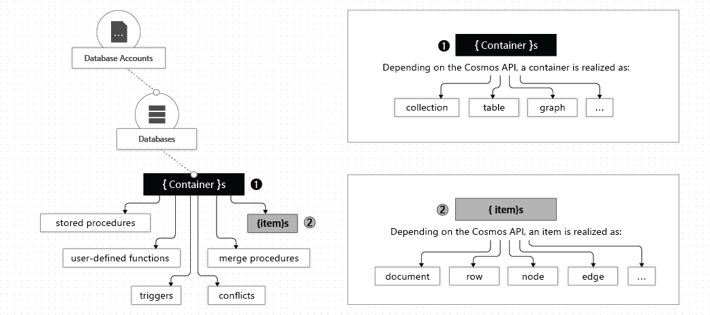

# 5. Long-term Memory 구성

## Azure Cosmos DB 구성

### Azure Cosmos DB 생성

1. [Azure Portal](https://portal.azure.com) 검색창에 `cosmos`를 입력하고 `Azure Cosmos DB` 메뉴를 클릭합니다.
2. 상단 `만들기` 버튼을 클릭합니다.
3. `Azure Cosmos DB for NoSQL` 섹션의 `만들기` 버튼을 클릭합니다.
4. `기본 사항` 탭을 아래와 같이 구성합니다.
    - 워크로드 유형 : 개발/테스트
    - 리소스 그룹 : ai-workshop-rg
    - 계정 이름 : finassist-ltm-db
    - 가용성 영역 : 사용 안함
    - 위치 : (Asia Pacific) Korea Central
    - 용량 모드 : 프로비저닝된 처리량
5. 나머지 설정은 그대로 두고 `검토+만들기` , `만들기` 버튼을 클릭해 데이터베이스를 생성합니다.
6. 리소스 배포가 완료되면 `리소스로 이동` 버튼을 클릭합니다.
7. `개요` 페이지에서 `URI`를 복사해 둡니다.

### Database / Container 생성



**데이터 구조**

```json
{
  "customerId":"C1001",
  "name":"김민수",
  "riskProfile":"안정형",
  "interests":["예금","IRP"],
  "notes":[
    "원금 손실 상품에 매우 민감함",
    "노후 대비 목적 상품 관심",
    "세액공제 혜택 문의 이력 있음"
  ],
  "lastConsultDate":"2026-05-10"
}
```

1. 왼쪽 메뉴에서 `데이터 탐색기`를 클릭합니다.
2. 탐색기 창에서 `+New` 버튼을 클릭하고, `+New Container`를 선택합니다.
3. New Container 화면이 뜨면 아래와 같이 구성합니다.
    
    
    
    - Database id : financial-chatbot-db
    - Container id : customer-memory
    - Partition Key : /customerId
4. 나머지 설정은 그대로 두고 `OK` 버튼을 클릭합니다.

### 샘플 데이터 입력

**업로드 권한 설정**

포털에서 파일을 업로드하기 위해 Cloud Shell을 열고 아래 명령어를 실행합니다.

```bash
# 1. 현재 로그인한 유저의 Object ID 가져오기
USER_PRINCIPAL_ID=$(az ad signed-in-user show --query id --output tsv)

# 2. Cosmos DB 데이터 기여자 역할 부여
az cosmosdb sql role assignment create \
    --account-name "finassist-ltm-db" \
    --resource-group "ai-workshop-rg" \
    --scope "/" \
    --principal-id "$USER_PRINCIPAL_ID" \
    --role-definition-id "00000000-0000-0000-0000-000000000002"
```

1. 컨테이너가 생성되면 왼쪽 탐색기에서 생성된 `customer-memory`를 클릭하고 하위의 `Items`를 클릭합니다.
2. 탐색기 상단의 `Upload Item` 버튼을 클릭하고, 다운로드한 `long_term_memory.json` 파일을 선택하고 업로드합니다.
    
    
    

## Container Apps 업데이트

### Container Registry 이미지 업데이트

1. 상단의 `Cloud Shell` 버튼을 클릭합니다.
2. 업데이트된 이미지를 컨테이너 레지스트리로 가져옵니다.
    
    ```bash
    az acr import \
      --name finassistrepoannajeong \
      --source docker.io/annajeong/finassist-chatbot:ltm \
      --image finassist-chatbot:ltm
    ```
    

### Container Apps 이미지 업데이트

### 이미지 업데이트 및 환경 변수 추가

Container Apps는 **ACR에 같은 태그로 이미지를 push해도 자동 반영되지 않을 수 있어서**, 새 Revision을 만듭니다.

1. 검색창에 `container`를 입력하고 `Container Apps` 메뉴를 클릭합니다.
2. 리스트에서 `finassist-app`을 클릭합니다.
3. 왼쪽 사이드바 메뉴 중 `애플리케이션` 섹션 하위에 있는 `수정 버전 및 복제본` 메뉴를 선택합니다.
4. 화면 상단 툴바에 있는 `새 수정 버전 만들기` 버튼을 클릭합니다.
5. 하단 컨테이너 이미지 섹션에서 `finassist-app`을 클릭합니다.
6. 컨테이너 편집 화면에서 나머지 설정은 그대로 두고 `이미지 태그를 ltm`으로 수정하고 `저장` 버튼을 클릭합니다.
7. 나머지 설정은 그대로 두고 `만들기` 버튼을 클릭합니다.
8. 다시 컨테이너 행에 `finassist-app`을 클릭한 뒤, 우측에 `편집` 버튼을 누릅니다.
9. 컨테이너 템플릿 편집 창이 열리면 `환경 변수` 탭으로 이동합니다.
10. 나머지 변수값은 그대로 두고 `+추가` 버튼을 클릭합니다.
11. `AZURE_COSMOS_ENDPOINT`를 추가하고 **앞서 복사한 Cosmos DB의 엔드포인트를 붙여넣습니다.**
12. `저장` 버튼을 클릭하고 `만들기` 버튼을 클릭합니다.

### Cosmos DB 액세스 권한 설정

Container Apps에서 LTM을 사용하기 위해 Cosmos DB에 액세스 하기 위한 권한이 필요합니다. 

1. `finassist-app` 화면 왼쪽 메뉴에서 `보안` > `ID` 를 클릭합니다.
2. **개체(보안 주체) ID**를 복사합니다.
3. `Cloud Shell`에서 아래 명령어를 실행합니다.

```bash
PRINCIPAL_ID=<Container Apps ID>

az cosmosdb sql role assignment create \
  -g ai-workshop-rg \
  -a finassist-ltm-db \
  --scope "/" \
  --principal-id $PRINCIPAL_ID \
  --role-definition-name "Cosmos DB Built-in Data Contributor"
  
# Container Apps 재시작
az containerapp revision list \
  -g ai-workshop-rg \
  -n finassist-app \
  -o table
  
az containerapp revision restart \
  -g ai-workshop-rg \
  -n finassist-app \
  --revision finassist-app--abc123
```

### 애플리케이션 테스트

아래 프롬프트를 사용하여 애플리케이션을 테스트 합니다.


```
이준호 고객의 투자 성향과 이전 상담 내용을 요약해줘.
임서연 고객의 성향을 기반으로 추천할 수 있는 금융상품 유형을 정리해줘.
```